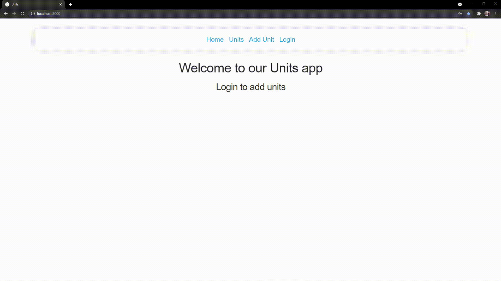

<p align="center">
  <a href="https://github.com/Rohit19060/units-react-with-auth" title="Units React">
    
  </a>
</p>
<h1 align="center">🌟 Units React 🌟</h1>
<p align="center">App to show react authentication and static working</p>

<p align="center">
<a href="https://github.com/Rohit19060/units-react-with-auth/blob/master/LICENSE" title="License">

</a>
<a href="https://github.com/Rohit19060/units-react-with-auth/fork" title="Forks">

</a>
<a href="https://github.com/Rohit19060/units-react-with-auth/stargazers" title="Stars">

</a>
<a href="https://github.com/Rohit19060/units-react-with-auth/issues" title="Issues">

</a>
<a href="https://github.com/Rohit19060/units-react-with-auth/pulls" title="Pull Requests">

</a>
<a href="https://github.com/Rohit19060/units-react-with-auth" title="Repo Size">

</a>
<a href="https://discord.gg/2wpHNSjwm2" title="Join King Tech's Community">

</a>
</p>

<p align="center" title="Units React"></p>

<h2 align="center">🌐 Links 🌐</h2>
<p align="center">
    <a href="https://github.com/Rohit19060/units-react-with-auth" title="Units React Repo">📂 Repo</a>
    ·
    <a href="https://github.com/Rohit19060/units-react-with-auth/issues/new/choose" title="🐛Report Bug/🎊Request Feature">🚀 Got Issue</a>
</p>

## 🚀 Features

- **Authentication System**

- **Add/Delete Units**

- **JSON as Database**

- **Upper/Lower Case Units Name**

## 🦋 Prerequisite

- Basic Understanding of [HTML](https://youtu.be/JHv2jmnrLlA "HTML - First Step Towards Web Development")

- Basic Understanding of [CSS](https://youtu.be/d1tP7ow7HbQ "CSS - Second Step Towards Web Development")

- Basic Understanding of JavaScript

- Basic Understanding of [React](https://reactjs.org/ "React")

- Basic Understanding of [Express](https://expressjs.com/ "Express")

- Basic Understanding of [Node](https://nodejs.org/ "Node")

- Basic Understanding of [NPM](https://www.npmjs.com/ "NPM")

## 🛠️ Installation Steps

1. Clone the repository

```Bash
git clone https://github.com/Rohit19060/units-react-with-auth.git
```

2. Change the working directory

```Bash
cd units-react-with-auth
```

3. Install Dependencies

```Bash
npm i
```

4. Run the app using terminal

```Bash
npm run dev
```

**🎇 You are Ready to Go!**

## ❗ Available Commands

In the project directory, you can run:

```Bash
npm start
```

This command will execute `react-scripts start`. The app is built using `create-react-app so this command Runs the app in Development mode. Open [http://localhost:3000](http://localhost:3000) to view it in the browser. You also need to run the server file as well to completely run the app. The page will reload if you make edits. You will also see any lint errors in the console.

```Bash
npm run build
```

This command will execute `react-scripts build`. Builds the app for production to the `build` folder. It correctly bundles React in production mode and optimizes the build for the best performance. The build is minified and the filenames include the hashes. Your app will be ready to deploy!

```Bash
npm run test
```

This command will execute `react-scripts test`. Launches the test runner in the interactive watch mode.

```Bash
npm run dev
```

This command will execute `concurrently "nodemon server" "npm run start"`. For running the server and app together I am using concurrently this helps a lot of MERN applications as it runs both the server (client and server) concurrently. So you can work on them both together.

```Bash
npm run serve
```

This command will execute `node server`, For running the server file on you can use this command.

## 👷 Built with

- [HTML](https://youtu.be/JHv2jmnrLlA "HTML - First Step Towards Web Development"): For creating Markups

- [CSS](https://youtu.be/d1tP7ow7HbQ "CSS - Second Step Towards Web Development"): For Designing

- JavaScript: React is a JavaScript library.

- [React](https://reactjs.org/ "React")

- [Express](https://expressjs.com/ "Express")

- [Node](https://nodejs.org/ "Node")

- [NPM](https://www.npmjs.com/ "NPM")

## 📂 Directory Structure

> [`server.js`](https://github.com/Rohit19060/units-react-with-auth/blob/main/server.js "Server"): Main Server File

> [`src/Components/*.js`](https://github.com/Rohit19060/units-react-with-auth/tree/main/src/Components "Components Directory"): All React components are in this directory

> [`src/server/units.json`](https://github.com/Rohit19060/units-react-with-auth/blob/main/src/server/units.json "Database File"): JSON File as Database

## 🎊 Future Updates

- [ ] Add Forgot Password

- [ ] Add Email and Notification Support

## 🧑🏻 Author

**Rohit Jain**

- 🌌 [Profile](https://github.com/Rohit19060 "Rohit Jain")

- 🏮 [Email](mailto:rohitjain19060@gmail.com?subject=Hi%20from%20Units%20React "Hi!")

- 🦁 [Website](https://kingtechnologies.in "Welcome")

<h2 align="center">🤝 Support</h2>

<h3 align="center">🎀 Contributions (<a href="https://guides.github.com/introduction/flow" title="GitHub flow">GitHub Flow</a>), 🔥 issues, and 🥮 feature requests are most welcome!</h3>

<h3 align="center">💙 If you like this project, Give it a ⭐ and Share it with friends!</h3>
<h3 align="center">💰 Donations Links</h3>
<p align="center">
<a href="https://www.paypal.me/kingrohitJ" title="PayPal"></a>
<a href="https://www.buymeacoffee.com/rohitjain" title="Buy me a Coffee"></a>
<a href="https://ko-fi.com/rohitjain" title="Ko-fi"></a>
</p>

<p align="center">Made with React & ❤️ in India</p>
